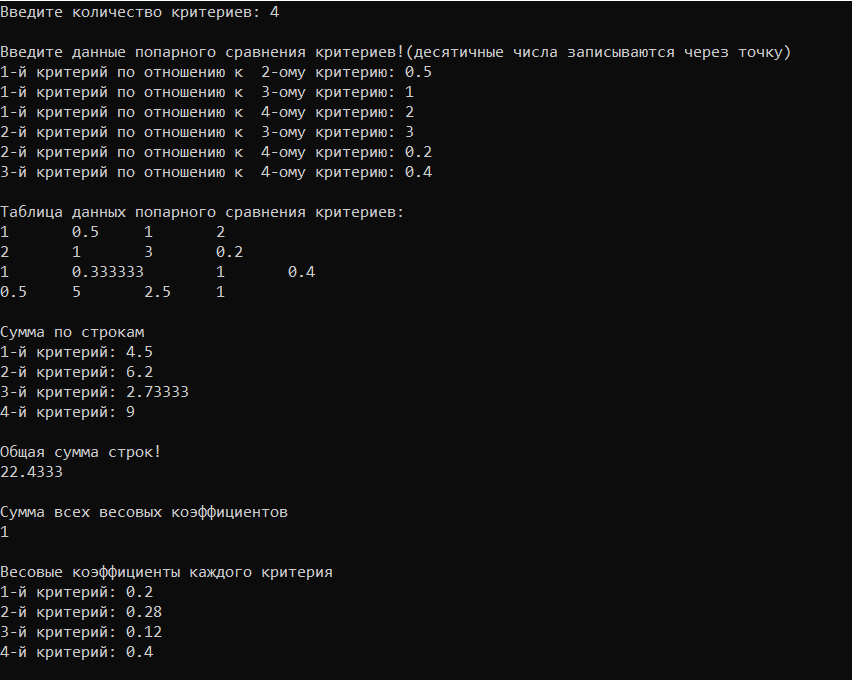
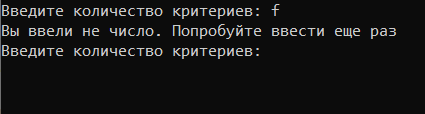
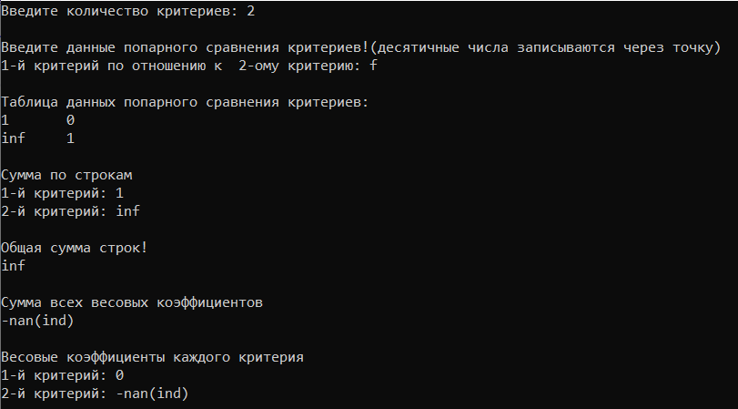
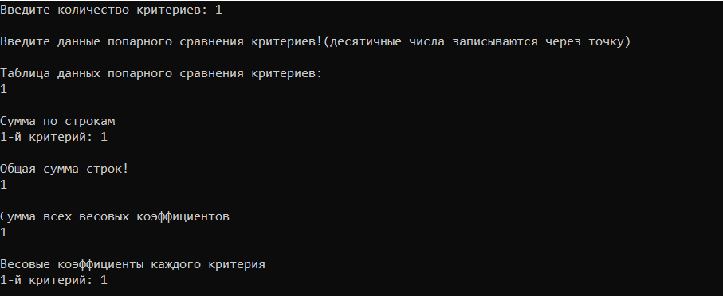

# Saatie

## Реализация метода анализа иерархий Томаса Саати

Данная программа реализует метода анализа иерархий Томаса Саати поможет автоматизировать необходимые расчеты и выбрать наиболее подходящую альтернативу. 

Приложение было раздаботано в среде Microsoft Visual Studio Community 2019. Поэтому самый удобный запуск его будет осуществлён именно там. Для открытия проекта необходимо открыть файл *.sln в корне репозитория.

При запуске программы мы видим консоль, которая запрашивает количество критериев и просит заполнить данные попарного сравнения 

Программа не будет работать , если вместо числа количесва критериев будет введо что-то другое 

При вводе нечисловых данных сравления программа не выдаст нужного результата 

Так же представлен пример работы сравления одного критерия с очевидным результатом 

